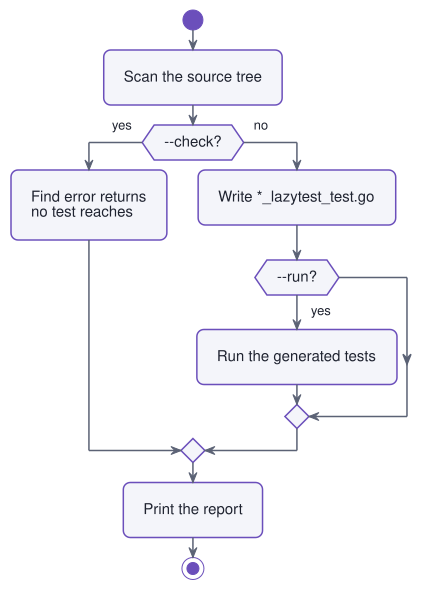
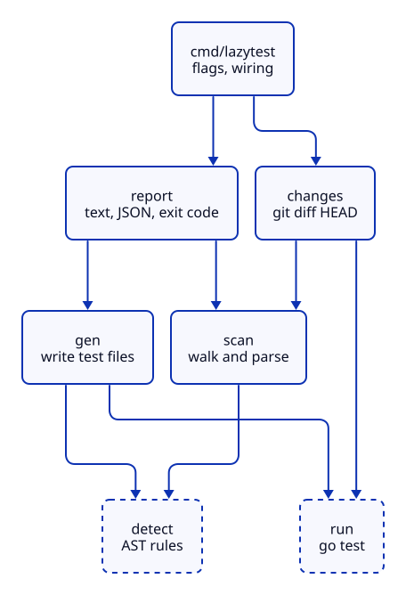

# How lazytest works

What happens between `lazytest` and a finished `*_lazytest_test.go`, every rule the detectors
use, and why things are the way they are. For usage see the [README](../README.md).

## The flow

<picture>
  <source media="(prefers-color-scheme: dark)" srcset="diagrams/flow-dark.svg">
  
</picture>

`--changed` filters the scan result by `git diff HEAD` before either branch. The exit code
comes from the report: `1` if there's something to look at, `2` if lazytest itself failed.

`main` only parses flags, calls `collect` to fill one `report.Result` and prints it. Every
error in a run is fatal, so `must(...)` ends the program instead of passing errors up.

## Packages

| Package | Job | Main files |
|---|---|---|
| `cmd/lazytest` | Flags, wiring, writing files, exit codes | `main.go` |
| `internal/detect` | Read one parsed file, return pattern matches and hints. Never touches disk | `detect.go`, one file per pattern (`http.go`, `json.go`, `pure.go`, `validation.go`), one per hint (`money.go`, `dates.go`, `auth.go`), `invariants.go` |
| `internal/scan` | Walk a tree, parse files, drop what's already tested, list dirs | `scan.go`, `constraint.go` |
| `internal/gen` | Turn matches into a gofmt'ed test file | `gen.go`, one file per pattern, `seeds.go` for edge values |
| `internal/run` | Run `go test` and turn its output into findings and error paths | `tests.go`, `coverage.go` |
| `internal/changes` | Lines changed since `HEAD`, and filters for scan results | `changes.go` |
| `internal/report` | Text and JSON output, the exit-code decision | one file per section, `result.go`, `json.go` |

<picture>
  <source media="(prefers-color-scheme: dark)" srcset="diagrams/packages-dark.svg">
  
</picture>

Shortcuts are left out: `cmd` also imports `scan`, `gen` and `run` directly, and `changes`
imports `detect`, but each already reaches them through another arrow. `detect` and `run` import nothing else from lazytest,
and only the standard library is used, no `golang.org/x/tools`.

Dashed arrows are imports. The diagrams are PlantUML; sources and the render command are in
[`diagrams/`](diagrams/).

## Scanning

- Skips the dirs the go tool skips: `vendor`, `testdata`, and anything starting with `.` or `_`
  (that's why `_example/` doesn't show up in lazytest's own checks).
- Skips files with a `// Code generated … DO NOT EDIT.` header.
- Every identifier in a directory's `_test.go` files goes into a set. A match counts as tested
  if its name (`Validate` for `User.Validate`) is in that set.
- When generating without `--force`, existing lazytest files count as tests, so a second run
  does nothing. With `--force` they don't, and the files get rewritten.
- Each source file remembers its build constraint, from a `//go:build` line or a file name like
  `open_linux.go`. The lazytest file gets the same constraint.

## Detection

All detection works on the AST alone. Imports are resolved through the file's import table,
so `nethttp.Request` with `import nethttp "net/http"` is still recognized. Functions are tried
in the order http-handler → validation → pure-func, and the first hit wins.

Functions without a body and methods on generic types (`Box[T]`) are skipped, since a test
can't call them.

### http-handler

- Two params `http.ResponseWriter` and `*http.Request`, as a function or a method.
- Or a function returning `http.HandlerFunc`. With params it's skipped later, because lazytest
  can't invent its dependencies.
- Records whether the body calls `json.NewDecoder` or `json.Unmarshal`. Only then do the
  invalid-JSON cases get generated.

### json-roundtrip

- Exported, non-generic struct with at least one `json` tag that isn't `json:"-"`.
- Fields that get a value: exported, named, not `json:"-"`, and of a type gen can build.
  Embedded structs, pointers, maps and nested structs stay at zero, which still round-trips.

### pure-func

- Exported, no receiver, no type params, at least one param and a result.
- Every param is a basic type, `time.Time`, a slice or a variadic of those.
- The body touches none of these: `go` statements, the packages `os`, `io`, `bufio`, `net`,
  `net/http`, `database/sql`, `log`, `syscall` and the `rand` packages, `time.Now`/`Since`/
  `Sleep`/`After`/timers, or `fmt.Print*`/`Fprint*`/`Scan*`. `fmt.Sprintf` is fine.

### validation

- Exactly one result, `error` or `bool`.
- And either a name starting with `Validate`, `IsValid` or `Check` at a word boundary
  (`checkName` yes, `Checkout` no) with one param, or zero params on a method like
  `User.Validate()`.
- Or a single `string` param. Struct params only count via the name: `Save(u *User) error`
  has the same shape and validates nothing.

### Invariants (pure funcs only)

| Invariant | Rule |
|---|---|
| parts sum to total | First param is an integer named like `total`, `amount`, `price`, `cost`, `balance`, `fee`, and the only result is a slice of that type |
| end not before start | Two `time.Time` results named like `start/from/begin` and `end/to/until/due/deadline`, or unnamed from a func named like `*Range`, `*Period`, `*Window` |

Names are split into words first (`unitPrice` → `unit`, `price`; `HTTPServer` → `http`,
`server`), so `feedback` never matches `fee`.

## Hints

| Domain | Fires on | Left alone |
|---|---|---|
| money | Field, param or var of type `float32/64` named with `amount`, `price`, `cost`, `balance`, `fee` | `total` (mostly counts and layout values), untyped `var x = 4.99` |
| dates | `time.Now()` directly followed by a calendar read: `.Year()`, `.Month()`, `.Day()`, `.Format(…)`, `.AddDate(…)`, … | `.UTC()`, `.In(loc)`, `.Add`, `.Sub`, `.Unix()`, comparisons, `start := time.Now()` |
| auth | `==` or `!=` where one side is named with `password`, `token`, `secret`, `session` | Comparisons with `nil`, `""` or a number |

The first versions of the money and dates rules fired far too often on real projects, see
[real-world runs](real-world.md#what-the-real-projects-changed-in-lazytest).

## Generation

One `gen.File` call per source file. A `builder` collects test bodies and imports, then one
template wraps them with the header, the build constraint and a sorted import block, and
`go/format` formats the result. Same input, byte-identical output.

### Edge values (`seeds.go`)

| Type | Values |
|---|---|
| string | `""`, `" "`, `"a"`, 10 000 × `x`, `"ünïcødé"`, `"😀"`, `"\x00"`, `"' OR 1=1 --"` |
| signed ints | `0, 1, -1, MaxIntN, MinIntN` |
| unsigned ints | `0, 1, MaxUintN` |
| floats | `0, -0, 0.1, -1, 1e308 / MaxFloat32, NaN, +Inf` |
| `[]byte` | `nil`, empty, `"a"`, 10 000 zero bytes |
| `time.Time` | Unix 0, 2024-02-29 (leap day), 9999-12-31, one second before 1970, 2026-01-01 midnight and the second before, both 2026 Berlin DST switches |
| bool | `false, true` |

### How each pattern becomes a test

- **Fuzz tests:** One `f.Add` row per seed. With several params, shorter seed lists wrap
  around. Go fuzzing can't take `time.Time` or `[]string`, so times are fuzzed as Unix seconds
  and slices as one element, then converted inside the fuzz body. Params named `t`, `f`, `got`
  or like an imported package get renamed (`arg1`), so they don't shadow anything.
- **Determinism check:** Calls the function twice and compares with `reflect.DeepEqual`.
  Results that print the same count as equal too, because `NaN != NaN`.
- **Validator tables:** Every case runs and then `t.Skipf("TODO(lazytest): …")`. lazytest never
  writes an expected business value. Only named validators with a string param get the extra
  "empty input is rejected" test.
- **Panics:** Every test body starts with a `recover`, so one panic fails one test and the
  rest of the package still runs. For methods the message names the zero-valued receiver as
  the likely cause.
- **No shared helpers:** Several lazytest files often end up in one package, and a helper func
  declared in each of them wouldn't compile.

## Running tests (`--run`)

1. Every directory holding a lazytest file runs `go test -json -run Lazytest .` on its own,
   so nested modules work and user tests stay out.
2. Every failing leaf test becomes a finding. A parent that only failed because a subtest
   failed is dropped.
3. The message is the first meaningful output line without the `file.go:12:` prefix. A fuzz
   seed's panic is printed under the parent test, so lazytest falls back to the parent's output.
4. A package that doesn't build becomes one finding with the compiler error.
5. Findings whose message ends with the zero-receiver note are marked `NeedsSetup`. They're
   listed apart and don't change the exit code.

## Untested error paths (`--check`)

1. Every directory with source files runs `go test -coverprofile`. A failing test still writes
   a profile, only a missing profile is an error.
2. Every `return` whose last value is `err`, or a call taking `err` like
   `fmt.Errorf("…: %w", err)`, is looked up in the profile blocks.
3. It's reported if it lies in an instrumented block that ran zero times and in no block that
   ran.

## `--changed`

`git diff --unified=0 HEAD` gives the changed lines per file, plus every untracked file as
fully changed. Paths are resolved through symlinks, since macOS reports `/private/var/…` for
`/var/…`.

- `--check` keeps only matches, hints and error paths whose lines changed.
- Generation keeps every match of a touched file, because the lazytest file is written as a
  whole and dropping matches would drop their tests.

## How lazytest itself is tested

| What | How |
|---|---|
| Detection | Golden files: each `internal/detect/testdata/*.go` lists matches *and* near misses, its `.golden` holds the expected matches, fields, invariants and hints. `go test ./internal/detect -update` rewrites them |
| Generation | Golden files for the generated code, plus one test that puts **all** fixtures and their generated tests into one temp module and runs `go vet` and `go test`. Two clashing lazytest files or a wrong build constraint fail there |
| Running | Temp modules with a planted panic and a broken build; `go test -json` output parsed from recorded events |
| Coverage | Temp module where one test covers only the happy path |
| `--changed` | Temp git repo with a commit, an edit and an untracked file |
| Reports | Table tests with the exact expected text and JSON |

`go test ./...` covers all of it. `go test -short` skips the parts that start the go tool or git.

## Known limits

Marked in the code with `ponytail:` comments, each naming its upgrade path:

| Where | Limit | Upgrade |
|---|---|---|
| `detect/pure.go` | I/O behind a call to another func isn't seen | go/types plus a call graph |
| `detect/imports.go` | Assumes the package name equals the last path element (except `/vN`) | go/packages |
| `detect/dates.go` | Only direct `time.Now().Year()` chains, not `now := time.Now(); now.Year()` | Track the variable |
| `scan/scan.go` | "Tested" means the name appears in a test file | Coverage, as for error paths |
| `gen/fuzz.go` | Slices are fuzzed with one element | Table tests for nil, empty, large |
| `run/tests.go` | One `go test` per directory | Batch per module if it gets slow |
| `scan/constraint.go` | Copy of go/build's GOOS/GOARCH lists | Add new ports |

## How it was built

Built in about 50 small commits following the milestones from the [pitch](../PITCH.md). Every commit
builds and passes its tests on its own.

| Milestone | Scope | Commits |
|---|---|---|
| M1 | Scan, four detectors, `--check` report | `981a987` |
| M2 | Generation for json-roundtrip and pure-func, writing files, `--force` | `89d9c84` … `d83e8f5` |
| M3 | Generation for http-handler and validation | `d7c5781` … `eaefcfd` |
| M4 | `--run` findings, `--changed`, untested error paths | `00ee8e1` … `ed9cfed` |
| M5 | Hints, invariants, DST and midnight seeds | `baeb013` … `37a038f` |
| Extra | `--json`; fixes from running on real projects | `c8bf6e8` … `3a92189` |

`git log --oneline` shows the whole sequence.
